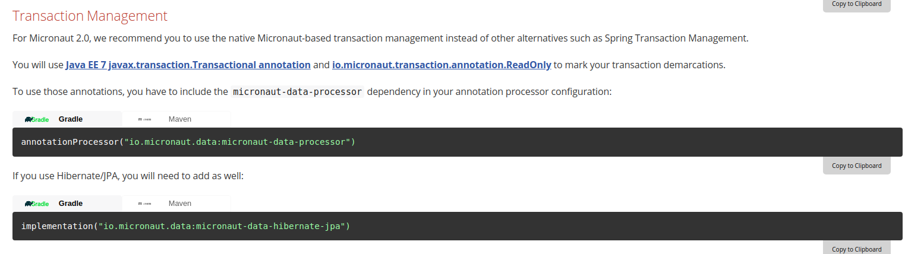

Thanks for reporting an issue, please review the task list below before submitting the
issue. Your issue report will be closed if the issue is incomplete and the below tasks not completed.

NOTE: If you are unsure about something and the issue is more of a question a better place to ask questions is on Stack Overflow (https://stackoverflow.com/tags/micronaut) or Gitter (https://gitter.im/micronautfw/). DO NOT use the issue tracker to ask questions.

### Task List

- [X] Steps to reproduce provided
- [X] Stacktrace (if present) provided
- [X] Example that reproduces the problem uploaded to Github
- [X] Full description of the issue provided (see below)

### Steps to Reproduce

I found that `io.micronaut.sql:micronaut-jooq` and `io.micronaut.data:micronaut-data-jdbc` aren't compatible. I have a project is to use `micronaut-jooq` written. Now, I want to use `micronaut-data` to refactor it, but there is an issue: `Caused by: io.micronaut.transaction.jdbc.exceptions.CannotGetJdbcConnectionException: No current JDBC Connection found. Consider wrapping this call in transactional boundaries.`

*If I add `@Transactional` or `@ReadOnly` to all method, there is no exception yet but it's unpractical.* 

**And I also found a problem. It seems that [`Micronaut-based transaction management`](https://docs.micronaut.io/latest/guide/index.html#upgrading) depends on `micronaut-data`? If there is only one line dependency `annotationProcessor("io.micronaut.data:micronaut-data-processor")` without `io.micronaut.data:micronaut-data-jdbc` or dependencies of `hibernate` as the official doc written, there will be no transaction manager work at all. You can just remove the dependency and observe what will happen.**

You can check above issues in my [demo](https://github.com/spencercjh/micronaut-data-sql-conflict): 

1. make sure the app can connect to the DB by the config in `application.yml`  
2. execute the `database.sql` to create the table
3. run `TestRepositoryTest`
4. or run `Application` then run `test.http`

### Expected Behaviour

They are test cases for proving transaction work well.

`TestRepositoryTest` should be passed.

`test.http` contains two associated requests. `create` first then `delete` and there will be a rollback. 

### Actual Behaviour

Continuous `Caused by: io.micronaut.transaction.jdbc.exceptions.CannotGetJdbcConnectionException: No current JDBC Connection found. Consider wrapping this call in transactional boundaries.`

### Environment Information

- **Operating System**: TODO
- **Micronaut Version:** 2.0.1
- **JDK Version:** 11.0.7

### Example Application

https://github.com/spencercjh/micronaut-data-sql-conflict

